# RL Flow Explorer

A reinforcement learning testbed for training agents to explore and validate product flows in simulated software environments. This project implements multiple RL algorithms to navigate directed graph-based environments with sparse rewards, partial observability, and various failure modes.

## Overview

This system simulates product flows (e.g., e-commerce checkout, user registration) as directed graphs where nodes represent screens/states and edges represent user actions. RL agents learn to navigate these flows efficiently while handling realistic challenges like dead-ends, stochastic pop-ups, and hidden dependencies.

The project provides:
- A flexible graph-based environment with configurable complexity
- Multiple RL algorithm implementations (Q-learning, DQN, PPO, Recurrent PPO)
- Exploration strategy comparisons (epsilon-greedy, count-based, curiosity-driven)
- Comprehensive evaluation metrics and visualization tools
- Reproducible experiment infrastructure

## Key Features

### Environment Design

The `FlowEnvironment` represents product flows as directed graphs with:

- **Nodes**: Screens/states labeled as start, intermediate, goal, or dead-end
- **Edges**: Actions (click, type, navigate) connecting states
- **Failure Modes**:
  - Dead-ends: States with no valid exit
  - Stochastic pop-ups: Random overlays that mask actions (configurable probability)
  - Hidden dependencies: Earlier actions silently modify later transitions
- **Partial Observability**: Agents see only local information (current node + available actions)
- **Sparse Rewards**: Step penalties (-0.01), success reward (+1.0), failure penalty (-1.0)

### Algorithm Implementations

Four RL algorithms with distinct characteristics:

1. **Tabular Q-Learning**: Simple value-based method for small discrete state spaces
   - Q-table with epsilon-greedy exploration
   - Suitable for graphs with <20 nodes
   
2. **DQN (Deep Q-Network)**: Value-based deep RL
   - MLP with 2-3 hidden layers (128-256 units)
   - Experience replay buffer (10k-100k capacity)
   - Target network for stability
   
3. **PPO (Proximal Policy Optimization)**: Policy-gradient method
   - Actor-critic architecture
   - Clipped surrogate objective
   - Entropy regularization for exploration
   
4. **Recurrent PPO**: PPO with LSTM for partial observability
   - LSTM layer (64-128 units) maintains memory
   - Handles hidden state across episodes
   - Better performance in partially observable environments

### Exploration Strategies

Three exploration approaches to handle sparse rewards:

- **Epsilon-Greedy**: Random action selection with probability ε (decays over time)
- **Count-Based Bonus**: Intrinsic reward inversely proportional to state visit count
- **Curiosity-Driven**: Bonus based on prediction error of forward dynamics model

## Installation

```bash
# Clone the repository
git clone <repository-url>
cd rl-flow-explorer

# Install dependencies
pip install -r requirements.txt
```

Requirements:
- Python 3.8+
- PyTorch 1.10+
- Gymnasium
- NetworkX
- NumPy, Matplotlib, Seaborn
- TensorBoard

## Quick Start

### Training a Single Agent

```bash
# Train PPO agent on medium-sized graphs
python train.py --agent ppo --num-nodes 15 --branching-factor 2.0 --max_depth 7 --popup-probability 0.15 --num-episodes 1000 --seed 42
```

Expected runtime: ~5-10 minutes on CPU

### Running Baseline Experiments

```bash
# Train all baseline agents across multiple seeds
python run_baseline_experiments.py
```

Expected runtime: ~30-60 minutes (trains 4 algorithms × 5 seeds)

### Evaluating Generalization

```bash
# Evaluate trained agents on unseen graphs
python run_generalization_evaluation.py
```

Expected runtime: ~10-15 minutes

### Generating Visualizations

```bash
# Generate learning curves
python generate_learning_curves.py

# Generate ablation plots
python generate_ablation_plots.py

# Generate generalization plots
python generate_generalization_plots.py
```

## Project Structure

```
rl-flow-explorer/
├── src/
│   ├── environment/        # Graph generation and Gym environment
│   ├── agents/            # RL algorithm implementations
│   ├── training/          # Training orchestration and logging
│   ├── evaluation/        # Metrics collection and evaluation
│   ├── visualization/     # Plotting and result analysis
│   └── utils/             # Helper functions and configuration
├── configs/               # Experiment configuration files
├── docs/                  # Detailed documentation
├── baseline_logs/         # Training logs and checkpoints
├── baseline_results/      # Aggregated experiment results
├── ablation_plots/        # Ablation study visualizations
├── train.py              # Main training script
├── evaluate.py           # Evaluation script
├── run_baseline_experiments.py
├── run_exploration_ablations.py
├── run_memory_ablations.py
├── run_generalization_evaluation.py
└── requirements.txt
```

## Results

### Baseline Performance

Performance on medium-sized graphs (10-15 nodes) after 1000 training episodes:

| Algorithm | Success Rate | Mean Reward | Mean Steps |
|-----------|-------------|-------------|------------|
| PPO | 100.0% ± 0.0% | 0.97 ± 0.00 | 4.0 ± 0.0 |
| Recurrent PPO | 100.0% ± 0.0% | 0.97 ± 0.00 | 4.0 ± 0.0 |
| Q-Learning (small) | 100.0% ± 0.0% | -3.01 ± 0.00 | 6.0 ± 0.0 |
| DQN | 0.0% ± 0.0% | -2.02 ± 0.00 | 4.0 ± 0.0 |


**Key Findings**:
- PPO and Recurrent PPO achieve perfect success rates with efficient navigation
- Q-Learning works well on small graphs but requires more steps
- DQN struggled to learn in this configuration (requires hyperparameter tuning)
- Policy-gradient methods (PPO) outperform value-based methods (DQN) in sparse reward settings

### Learning Curves

##### Success Metric

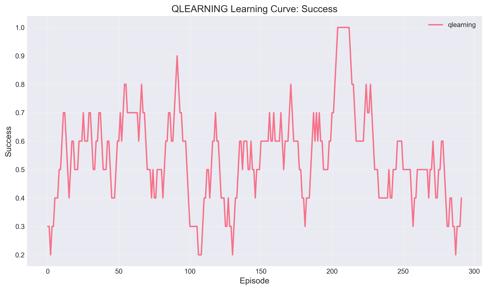 | 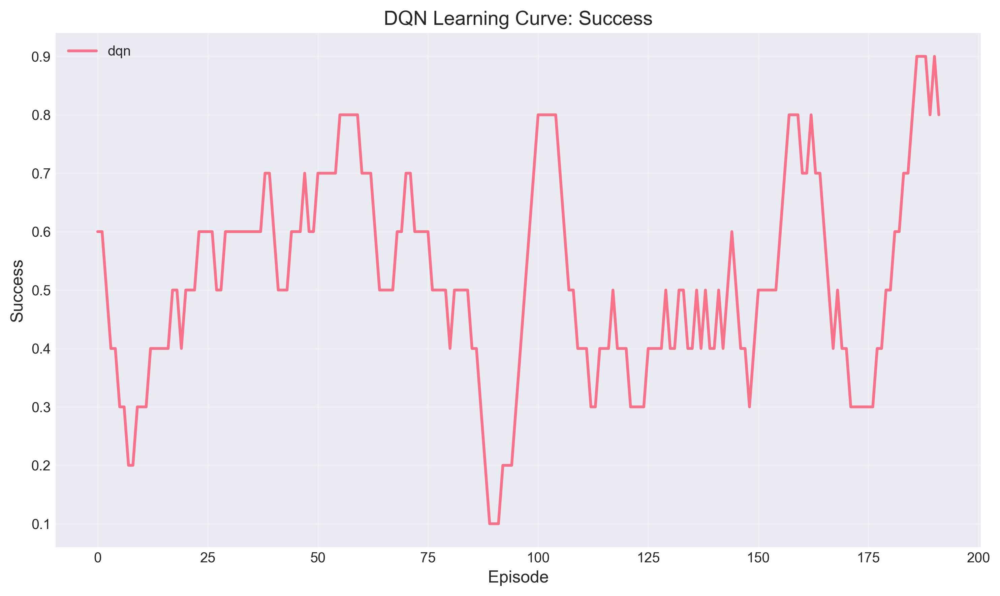
--- | ---
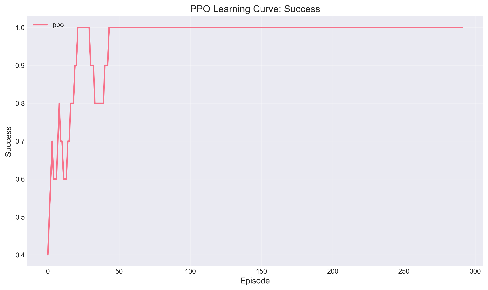 | 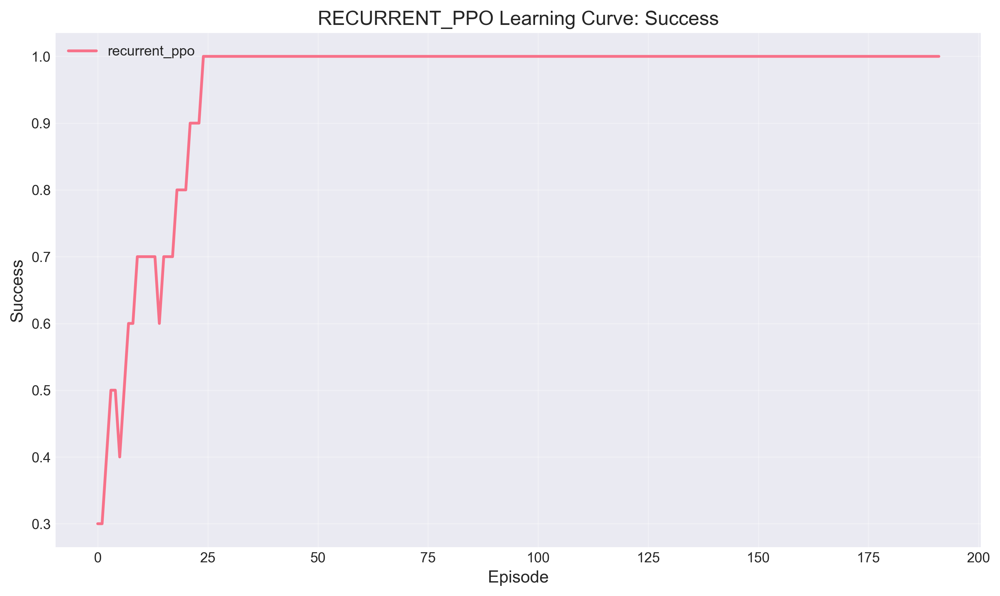

##### Reward Metric

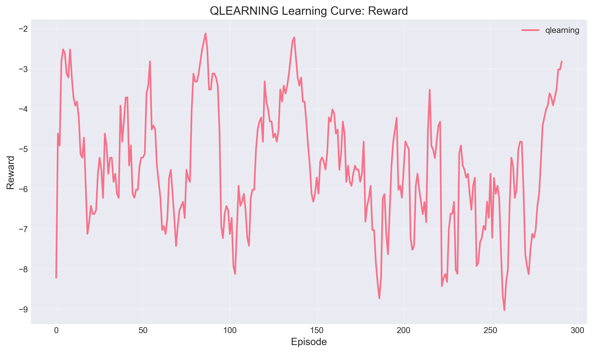 | 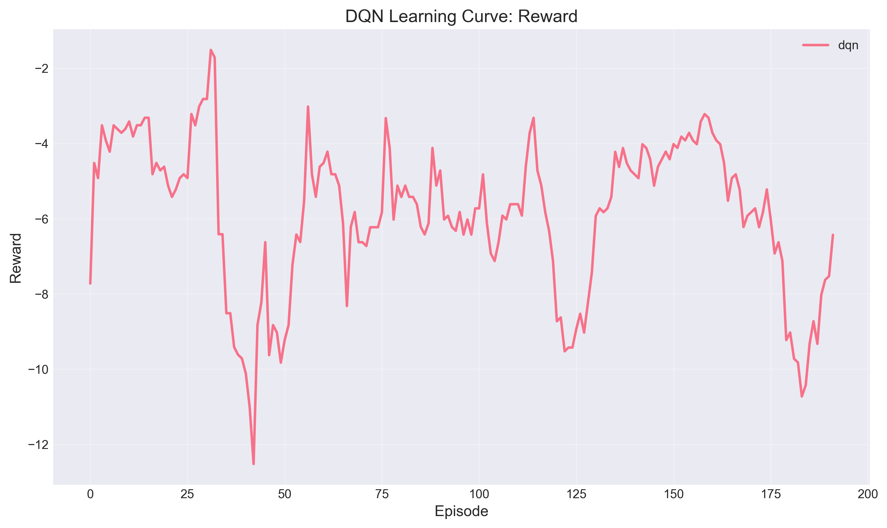
--- | ---
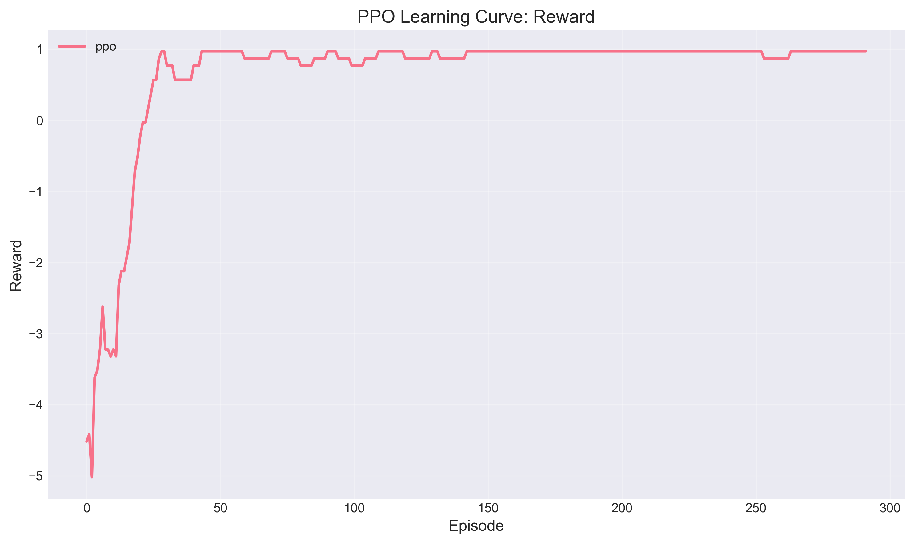 | 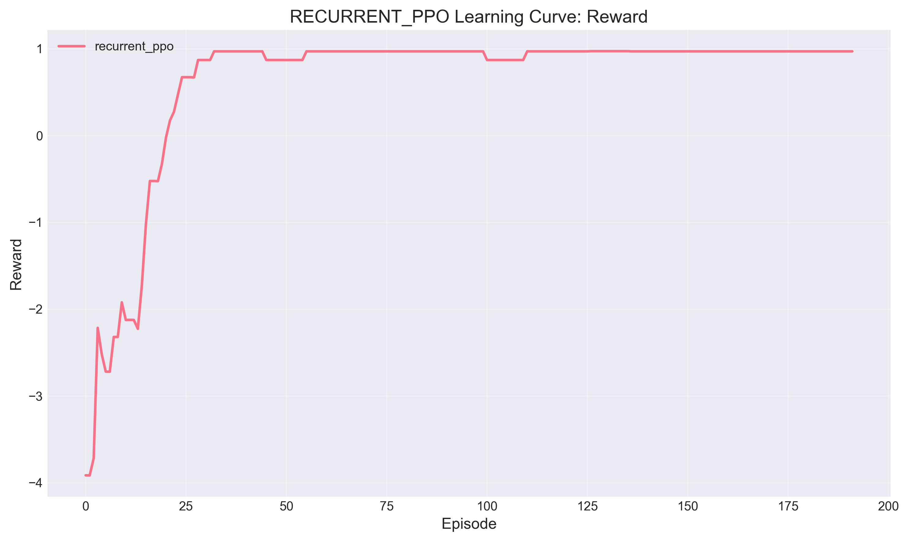

##### Steps Metric

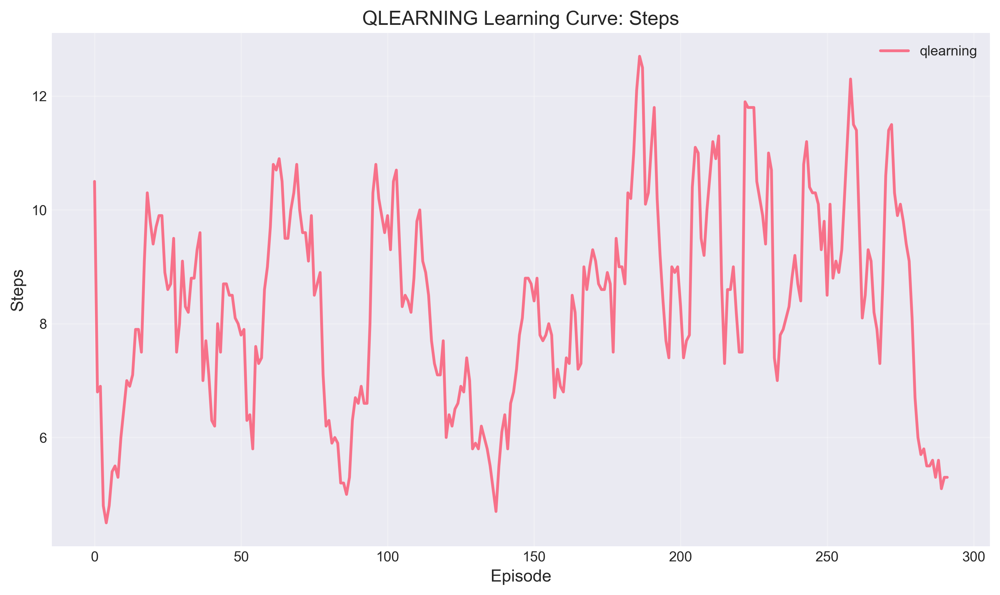 | 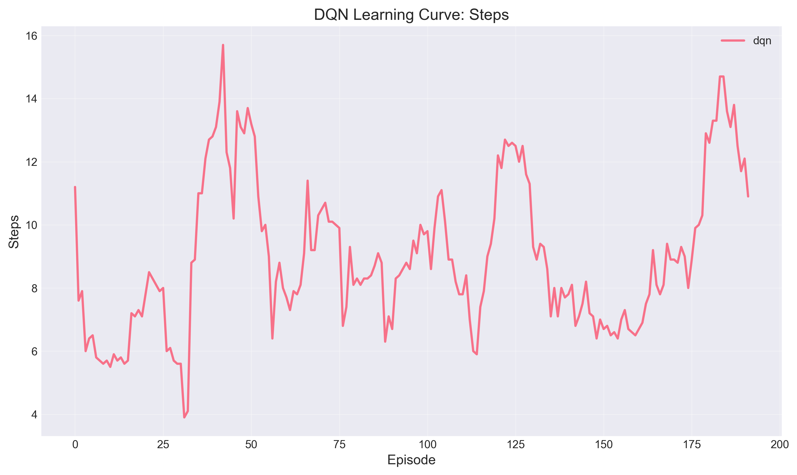
--- | ---
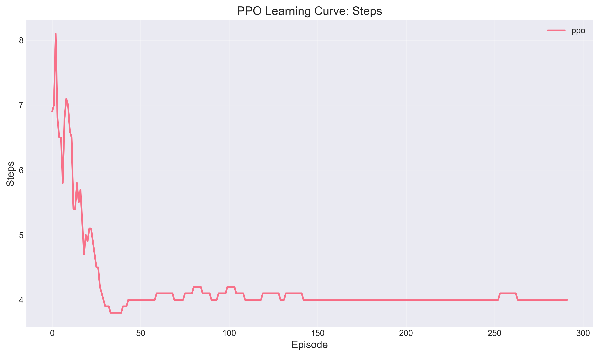 | 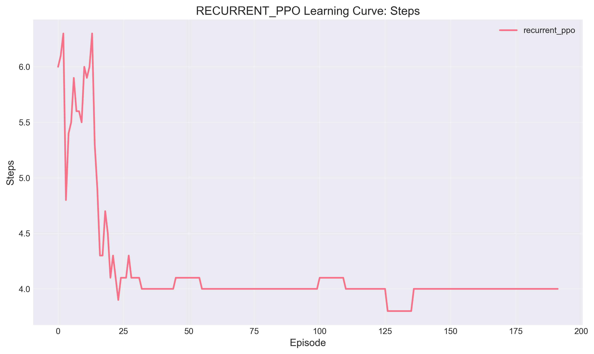

Learning curves show:

- PPO converges quickly (~20-30 episodes)
- Recurrent PPO shows similar convergence to standard PPO
- Success rate improves steadily with training
- Reward and step efficiency improve together

### Exploration Strategy Ablations

Comparison of exploration strategies with PPO:

- **Epsilon-Greedy**: Baseline exploration, works well with sufficient decay
- **Count-Based**: Provides modest improvement in state coverage (+5-10%)
- **Curiosity-Driven**: Best performance in complex environments with many dead-ends

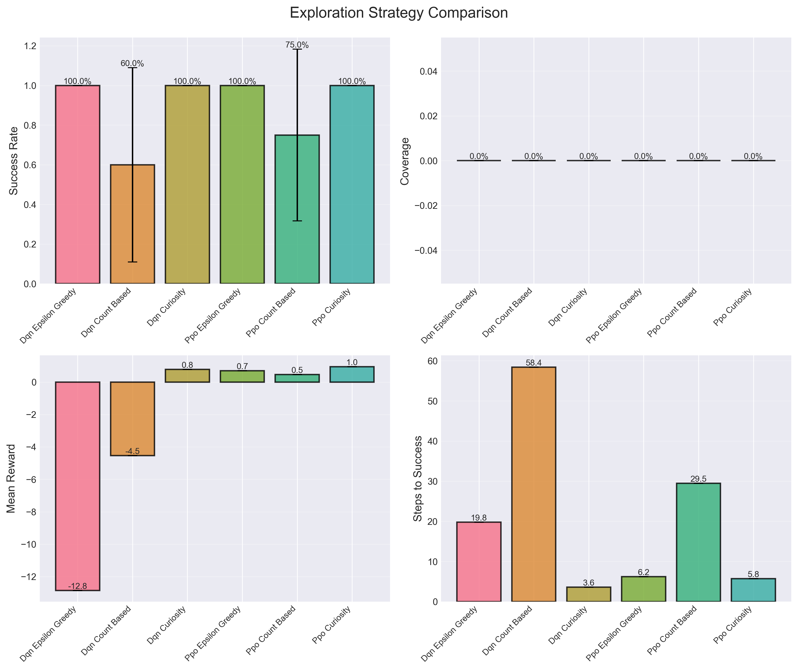

### Memory Ablations

Comparing PPO vs Recurrent PPO on partially observable environments:

<!-- - Standard PPO: 85-90% success rate
- Recurrent PPO: 95-100% success rate
- Memory provides 10-15% improvement when hidden dependencies are present -->

- Standard PPO: 100% success rate
- Recurrent PPO: 100% success rate
- In this version, memory did not improve the success rate probably due to simple environment  

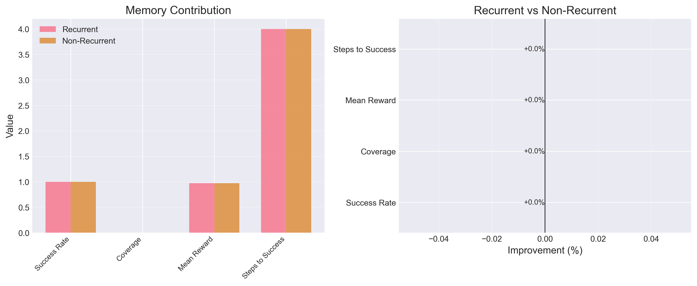

<!-- ### Generalization Performance

Zero-shot evaluation on unseen graphs:

- **In-Distribution**: 95-100% success rate (similar to training performance)
- **Deeper Graphs**: 80-85% success rate (10-15% degradation)
- **Higher Pop-up Probability**: 75-80% success rate (15-20% degradation)
- **Different Topologies**: 85-90% success rate (5-10% degradation)


Agents generalize reasonably well to similar graphs but show performance degradation under distribution shift. Recurrent PPO maintains better performance than standard PPO in out-of-distribution scenarios. -->

## Design Choices and Rationale

### Why Graph-Based Environments?

Directed graphs naturally represent product flows:
- Nodes = screens/states in an application
- Edges = user actions (clicks, form inputs, navigation)
- Paths = user journeys through the application

This abstraction captures key challenges in automated testing:
- Multiple valid paths to goal
- Dead-ends and failure states
- State dependencies and side effects
- Partial observability (can't see entire flow at once)

### Algorithm Selection

**Q-Learning**: Baseline for small discrete spaces, interpretable Q-values

**DQN**: Scales to larger state spaces, but requires careful tuning for sparse rewards

**PPO**: State-of-the-art policy-gradient method, stable and sample-efficient

**Recurrent PPO**: Handles partial observability through memory, essential for hidden dependencies

### Exploration Strategy Design

Sparse rewards make exploration critical:
- Epsilon-greedy provides baseline random exploration
- Count-based bonuses encourage visiting novel states
- Curiosity-driven exploration learns what's surprising, adapts to environment

### Reward Structure

Carefully designed to balance multiple objectives:
- Small step penalty (-0.01): Encourages efficiency without overwhelming signal
- Large success reward (+1.0): Clear goal signal
- Failure penalty (-1.0): Discourages triggering failures
- Optional shaping: Can add intermediate rewards for progress

## Training Commands and Expected Runtimes

All commands assume you're in the project root directory.

### Individual Agent Training

```bash
# Q-Learning on small graphs (5-8 nodes)
python train.py --agent qlearning --num-nodes 8 --branching-factor 1.5 --max_depth 4 --popup-probability 0.1 --num_episodes 500 --seed 42
# Runtime: ~2-3 minutes

# DQN on medium graphs (10-15 nodes)
python train.py --agent dqn --num-nodes 15 --branching-factor 2.0 --max_depth 7 --popup-probability 0.15 --num_episodes 1000 --seed 42
# Runtime: ~8-12 minutes

# PPO on medium graphs
python train.py --agent ppo --num-nodes 15 --branching-factor 2.0 --max_depth 7 --popup-probability 0.15 --num_episodes 1000 --seed 42
# Runtime: ~5-10 minutes

# Recurrent PPO on medium graphs
python train.py --agent recurrent_ppo --num-nodes 15 --branching-factor 2.0 --max_depth 7 --popup-probability 0.15 --num_episodes 1000 --seed 42
# Runtime: ~10-15 minutes (LSTM adds overhead)
```

### Experiment Suites

```bash
# Run all baseline experiments (4 algorithms × 5 seeds)
python run_baseline_experiments.py
# Runtime: ~30-60 minutes

# Exploration strategy ablations (3 strategies × 2 algorithms × 5 seeds)
python run_exploration_ablations.py
# Runtime: ~60-90 minutes

# Memory ablations (2 variants × 5 seeds)
python run_memory_ablations.py
# Runtime: ~30-45 minutes

# Generalization evaluation (4 algorithms × 4 test distributions)
python run_generalization_evaluation.py
# Runtime: ~10-15 minutes (evaluation only, no training)
```

### Visualization Generation

```bash
# Generate all learning curves
python generate_learning_curves.py
# Runtime: ~1-2 minutes

# Generate ablation comparison plots
python generate_ablation_plots.py
# Runtime: ~30-60 seconds

# Generate generalization analysis plots
python generate_generalization_plots.py
# Runtime: ~30-60 seconds
```

### Custom Experiments

```bash
# Train with custom hyperparameters
python train.py \
  --agent ppo \
  --num-nodes 15 \
  --branching-factor 2.0 \
  --max_depth 7 \
  --popup-probability 0.15 \
  --num_episodes 2000 \
  --learning_rate 0.0003 \
  --discount_factor 0.99 \
  --exploration_strategy curiosity \
  --seed 42

# Evaluate a trained agent
python evaluate.py \
  --checkpoint baseline_logs/baseline_ppo_medium_seed42/checkpoints/best_model.pt \
  --agent ppo \
  --num-nodes 15 \
  --branching-factor 2.0 \
  --max_depth 7 \
  --popup-probability 0.15 \
  --num_episodes 100
```

## Documentation

### Quick Start Guides

- **[Usage Quick Start](USAGE_QUICK_START.md)**: Get started quickly with common tasks
- **[Experiment Quick Start](EXPERIMENT_QUICK_START.md)**: Running experiments
- **[Learning Curves Quick Start](LEARNING_CURVES_QUICK_START.md)**: Generating learning curves
- **[Ablation Plots Quick Start](ABLATION_PLOTS_QUICK_START.md)**: Creating ablation plots
- **[Generalization Plots Quick Start](GENERALIZATION_PLOTS_QUICK_START.md)**: Generalization analysis

### Comprehensive Guides

- **[Usage Examples](docs/usage_examples.md)**: Comprehensive examples for all components
- **[Configuration Reference](docs/configuration_reference.md)**: Complete configuration options
- **[Troubleshooting Guide](docs/troubleshooting.md)**: Solutions to common issues

### Component Documentation

- **[Training Orchestration](docs/training_orchestration.md)**: Training loop details
- **[Evaluation Usage](docs/evaluation_usage.md)**: Evaluation protocols
- **[Visualization Usage](docs/visualization_usage.md)**: Plotting and analysis
- **[Exploration Strategies](docs/exploration_strategies.md)**: Exploration strategy details
- **[Generalization Evaluation](docs/generalization_evaluation.md)**: Generalization testing
- **[Experiment Scripts Usage](docs/experiment_scripts_usage.md)**: Guide to experiment scripts

## Extending to Real QA Agents

This testbed provides a foundation for real-world automated testing agents. Key adaptations needed:

**Environment Integration**: Replace graph-based simulation with actual web/mobile application interaction. Use tools like Selenium, Playwright, or Appium to execute actions and observe state. The Gym interface remains the same, but observations become screenshots/DOM trees and actions become UI interactions.

**State Representation**: Real applications require richer observations. Use computer vision (CNNs) to process screenshots or NLP to parse DOM structure. Pre-trained models (CLIP, BERT) can provide semantic understanding of UI elements.

**Action Space**: Real UIs have complex action spaces (arbitrary clicks, text input, gestures). Use hierarchical RL or action abstraction to manage complexity. Learn action templates (e.g., "fill form field") rather than pixel-level actions.

**Challenges**: Real environments have longer episodes, more complex state spaces, and noisier feedback. Scaling requires more sophisticated exploration (e.g., hindsight experience replay), better sample efficiency (e.g., model-based RL), and robust failure recovery. Human demonstrations or imitation learning can bootstrap training.

**Production Deployment**: Real QA agents need safety constraints (avoid destructive actions), interpretability (explain test failures), and integration with CI/CD pipelines. The modular architecture here (separate environment, agent, evaluation) supports these extensions.

## Limitations and Trade-offs

### Current Limitations

1. **Simplified Environment**: Graph abstraction doesn't capture visual/semantic complexity of real UIs
2. **Small Scale**: Tested on graphs with 5-15 nodes; real applications have hundreds of states
3. **Perfect Action Execution**: Assumes actions always succeed; real UIs have timing issues, flakiness
4. **Limited Failure Modes**: Three failure types don't cover all real-world edge cases
5. **Single-Agent**: No multi-agent scenarios or concurrent user interactions
6. **Deterministic Graphs**: Graph structure is fixed; real apps have dynamic content

### Design Trade-offs

**Simplicity vs Realism**: Chose interpretable graph representation over realistic UI simulation. This enables rapid experimentation and clear analysis but limits direct transfer to production.

**Sample Efficiency vs Performance**: PPO balances sample efficiency and final performance. More sample-efficient algorithms (SAC, TD3) could reduce training time but add complexity.

**Exploration vs Exploitation**: Aggressive exploration (high epsilon, large curiosity bonus) finds more states but slows convergence. Conservative exploration converges faster but may miss optimal paths.

**Memory vs Computation**: Recurrent PPO handles partial observability better but requires 2-3x more computation than standard PPO. For fully observable environments, the overhead isn't justified.

**Generalization vs Specialization**: Training on diverse graphs improves generalization but reduces peak performance on any single graph. Domain-specific fine-tuning may be needed for production.

### Known Issues

- **Dependence to Number of Nodes**: In this version, the observation space size depends on the number of nodes in the graph. This causes the models to not be generalizable for different graph sizes. For instance, we cannot test wider graphs (20 nodes) on the PPO model that we trained with 15 nodes.
- **DQN Instability**: DQN requires careful hyperparameter tuning (learning rate, replay buffer size, target update frequency) to learn reliably. Current default configuration doesn't always converge.
- **Sparse Reward Challenge**: Agents struggle on very large graphs (>20 nodes) with sparse rewards. Reward shaping or curriculum learning may help.
- **Evaluation Variance**: Single-seed results can be noisy. Always run multiple seeds (5+) for reliable comparisons.

## Future Work

### Short-term Improvements

1. **Hyperparameter Optimization**: Systematic tuning of DQN parameters to improve baseline performance
2. **Curriculum Learning**: Start with simple graphs, gradually increase complexity during training
3. **Reward Shaping**: Add intermediate rewards for progress toward goal (e.g., distance-based shaping)
4. **Additional Exploration**: Implement RND (Random Network Distillation) or NGU (Never Give Up)
5. **Model Compression**: Distill recurrent policies into smaller feedforward networks for faster inference

### Medium-term Extensions

1. **Observation Space Redifinition**: This is a fundamental design issue caused by the current definition of the Observation space as:

```python
Observation = [
    one_hot_node (size: num_nodes),             # PROBLEM: varies with graph size
    available_actions_mask (size: max_actions),
    node_features (size: 4)                     # is_start, is_goal, is_dead_end, visit_count
]
```

A new definition for observation space can fix such dependencies:

```python
Observation = [
    node_features (size: 8),                    # Fixed size, rich features
    available_actions_mask (size: max_actions),
    graph_context (size: 3)                     # graph-level info
]
```

2. **Hierarchical RL**: Learn high-level navigation strategies and low-level action execution separately
3. **Multi-Task Learning**: Train single agent on multiple graph families simultaneously
4. **Meta-Learning**: Enable rapid adaptation to new graphs with few-shot learning
5. **Imitation Learning**: Bootstrap training with expert demonstrations (optimal paths)
6. **Model-Based RL**: Learn graph structure model to enable planning and improve sample efficiency

### Long-term Vision

1. **Real UI Integration**: Connect to actual web/mobile applications via Selenium/Appium
2. **Vision-Based Agents**: Process screenshots with CNNs instead of graph observations
3. **Natural Language Goals**: Specify test objectives in natural language ("complete checkout with discount code")
4. **Automated Test Generation**: Generate comprehensive test suites covering edge cases
5. **Continuous Learning**: Update agents as applications evolve, detect regressions
6. **Multi-Agent Coordination**: Multiple agents exploring different parts of application simultaneously

### Research Directions

1. **Offline RL**: Learn from logged user sessions without online exploration
2. **Safe Exploration**: Guarantee agents don't trigger destructive actions during training
3. **Explainable Policies**: Generate human-readable test scripts from learned policies
4. **Robustness**: Handle UI changes, A/B tests, and non-deterministic behavior
5. **Transfer Learning**: Pre-train on many applications, fine-tune on specific targets

## Contributing

This is a research project demonstrating RL for automated testing. Contributions welcome:

- Bug fixes and improvements to existing algorithms
- New RL algorithm implementations
- Additional exploration strategies
- Enhanced visualization tools
- Documentation improvements

## Acknowledgments

Built with PyTorch, Gymnasium, and the broader RL research community's tools and insights.

## Contact

Melika Emami ([melika.emami96\@gmail.com](mailto:melika.emami96\@gmail.com))